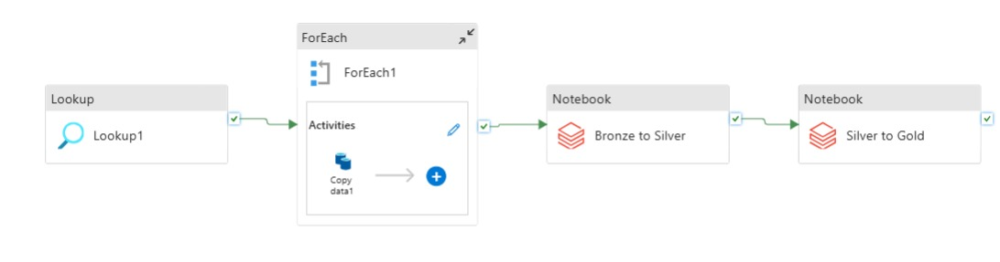
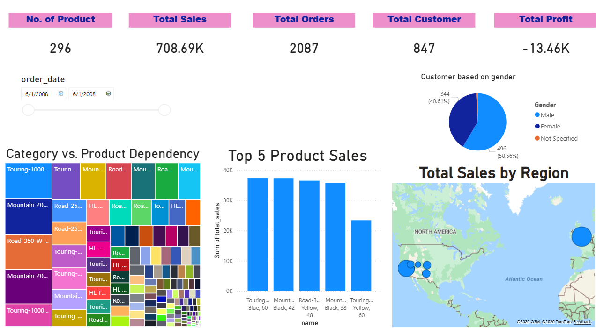

# 📊 Azure End-to-End Data Engineering Project

  

## 🚀 Project Overview

This project simulates a real-time business scenario and demonstrates how to build a complete data engineering pipeline on Azure. It extracts customer and sales data from an on-prem SQL database, processes it in the cloud, and visualizes insights through a Power BI dashboard.

## 🎯 Business Goal

The goal is to understand customer demographics especially gender and how they impact product sales.

### Key Requirements:
- **Sales by Gender & Product Category** – Analyze total sales and product preferences across Male, Female, and Not Specified customer groups.  

- **Geographical Sales Distribution** – Visualize sales performance across different regions, specifically North America and Europe.  

- **KPI Tracking** – Provide real-time visibility into high-level metrics including Total Sales, Total Orders, Total Customers, and Total Profit.  

- **Interactive Filtering** – Allow stakeholders to dynamically filter the dashboard by Order Date, Product Category, and Gender.  

- **User-Friendly Dashboard** – Create a centralized, automated interface for stakeholders to access actionable insights without manual intervention.

## 🛠️ Solution Summary

### 1. **Data Ingestion**
- Extract data from SQL Server
- Load into **Azure Data Lake Storage (ADLS)** via **Azure Data Factory (ADF)**

### 2. **Data Transformation**
- Clean & transform data using **Azure Databricks**
- Apply **Bronze → Silver → Gold** data layering

### 3. **Data Loading & Reporting**
- Load final data into **Azure Synapse Analytics**
- Build an interactive **Power BI Dashboard**

### 4. **Automation & Monitoring**
- Schedule pipelines to run **daily**
- Monitor pipelines using ADF & Synapse tools

### 5. **Security**
- Manage secrets using **Azure Key Vault**
- Apply **RBAC** with **Azure Entra ID**

## 🧰 Tech Stack

| Tool                  | Purpose                          |
|-----------------------|----------------------------------|
| Azure Data Factory    | Data orchestration               |
| Azure Data Lake Gen 2 | Raw & processed data storage     |
| Azure Databricks      | Data transformation              |
| Azure Synapse         | Data warehousing & analytics     |
| Power BI              | Data visualization               |
| Azure Key Vault       | Secret management                |
| SQL Server (On-Prem)  | Source database                  |

### 🛠️ Data Pipeline Diagram

  

## 📈 Power BI Dashboard

  

The dashboard displays:
- KPI Tracking: Displays total sales ($7.09M), total products (296), total orders (2,087), and total customers (847).

- Demographics: Highlights that the customer base is dominated by men (58.56%) compared to women (40.61%).

- Product Performance: Features a "Top 5 Product Sales" bar chart and category dependency tree maps.

- Geographical Analysis: Visualizes sales distribution across North America and Europe.

---

📚 *This project was created as part of my learning journey in cloud data engineering by following a YouTube tutorial.*
